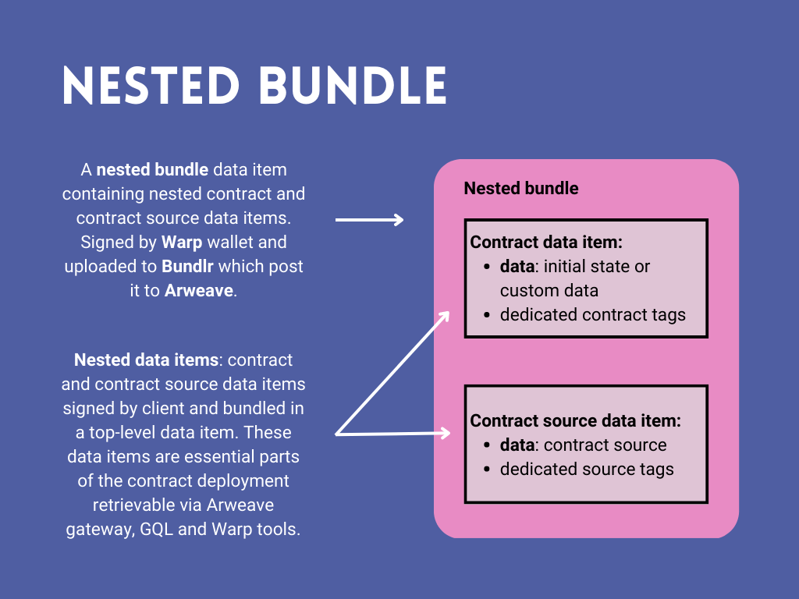

# Warp Bundled Contract Format

This document describes the core concepts behind the Warp bundled contract format.

## Introduction

The idea behind Warp Bundled Contract Format is to increase the Developer and User Experience.  
Normally, when a contract is being deployed on Arweave, one has to wait some time:

1. for the contract's transactions mining (~2 minutes)
2. for the proper contract's transactions confirmation (assuming at least 10 blocks - ~20 minutes)

This in total gives ~20-25 minutes, which:

1. Breaks the DX, e.g. in case developer wants to quickly test the new contract version on Arweave mainnet
2. Breaks the UX, e.g. if given protocol deploys the contracts dynamically - e.g. via GUI (e.g. deploying
   NFT collections, connecting deployed data with access rights, etc.)

Additionally, deploying contracts requires some amount of ARs in the wallet - which might further increase
the entry barrier, both for developers and given protocol users.

## Advantages of using Warp Gateway for contracts deployment

1. Contract is instantly available - as soon as proper response from Bundlr network is received.
2. Contract deployment does not require any ARs in the wallet - the deployment via Bundlr network is either
   fully subsidized by the Arweave (for transactions <= 100KiB) or by the Warp (for transactions > 100KiB).
   The max transaction size is currently 2MiB.
3. Even though the Bundlr transactions are created and signed by the Warp's wallet, it is still possible to identify
   the original transaction owner/signer.

## How it works

### Nested bundles

Bundling allows to write multiple data items into one top level transaction. A data item differs from a regular transaction by not allowing to transfer AR tokens and passing reward but it has most of the transaction's properties - such as owner, data, tags, owner and id.

In a nutshell, the nested bundles concept means that such data item of a bundle can also be a bundle containg other data items. According to ANS-104 standard it can lead to theoretically unbounded levels of nesting.

You can read the specification for nested bundles standard in [ANS-104](https://github.com/ArweaveTeam/arweave-standards/blob/master/ans/ANS-104.md#31-nested-bundle).

### Warp Gateway

Instead of posting the contract and contract source transactions directly to Arweave mainnet, [Warp Plugin](https://academy.warp.cc/sdk/advanced/plugins/deployment) creates data items from either both of them (when using `deploy` method) or only contract (when using `deployFromSourceTx` method) and send them to Warp Gateway where they are wrapped in a nested bundled and uploaded to Bundlr.

:::info
Bundling contract is the default behaviour of Warp's SDK `warp.deploy` function, when `forMainnet` instance is being used.
:::

The Warp Gateway uses nested bundle concept to deploy contract and contract source to Arweave:



1. The validity and tags of the data items are verified.

2. Data items are wrapped in a bundle:

```ts
const bundle = await bundleData([dataItem]);
```

3. Another data item - a nested bundle containg our contract or contract source data item - is created:

```ts
const bundlrTx = bundlr.createTransaction(bundle.getRaw(), tags);
```

A nested bundle contains following tags:

```ts
      { name: 'Bundle-Format', value: 'binary' },
      { name: 'Bundle-Version', value: '2.0.0' },
      { name: 'App-Name', value: 'Warp' },
      { name: 'Action', value: 'WarpContractDeployment' }
```

4. Our nested bundle is signed and uploaded to Bundlr which then post it to Arweave:

```ts
await bundlrTx.sign();
const bundlrResponse = await bundlr.uploader.uploadTransaction(bundlrTx, { getReceiptSignature: true });
```

5. After receiving proper response and receipt from Bundlr, the Warp gateway indexes the contract transactions data internally - to make them instantly available.

6. Finally, the Warp gateway returns an object as a `response` - that consists of fields:

- `response.contractTxId` - contract id
- `response.srcTxId` - contract source id
- `response.bundlrTxId` - id of the nested bundle containing contract and contract source data items

## Resulting transaction structure

This is how the example contract `o0SKH5SER-pJa50rxB891ZoumWdt8PBindQAtvhbeYw` looks like on [ViewBlock](https://viewblock.io/arweave/tx/o0SKH5SER-pJa50rxB891ZoumWdt8PBindQAtvhbeYw).

:::note

Keep in mind that it takes some time before Bundlr posts given bundle to Arweave and ViewBlock actually index such bundle and its contents - usually it may take 1-2 days.

:::

1. The `o0SKH5SER-pJa50rxB891ZoumWdt8PBindQAtvhbeYw` is the id of the contract data item - according to ANS-104 [specs](https://github.com/ArweaveTeam/arweave-standards/blob/master/ans/ANS-104.md#2-dataitem-signature-and-id).
2. The `gZYT07AIXZ9oQ0xkUIJC6IMVYh82prapK-VS34h_G30` is the id of the Arweave nested bundle transaction - that contains a data item from point 1, according to ANS-104 [specs](https://github.com/ArweaveTeam/arweave-standards/blob/master/ans/ANS-104.md#31-nested-bundle)

:::note
The first data item is effectively important from the SmartWeave protocol perspective - it is the transaction that the protocol 'sees' when it loads the contract.
:::

## Contract transaction retrieval via Arweave gateway

1. Arweave gateway, using `response.contractTxId`: https://arweave.net/o0SKH5SER-pJa50rxB891ZoumWdt8PBindQAtvhbeYw

2. Arweave GQL:, using `response.contractTxId`

```qql
query {
  transactions(
    ids: ["o0SKH5SER-pJa50rxB891ZoumWdt8PBindQAtvhbeYw ]
  ) {
    edges {
      node {
          id
          tags {
            name
            value
          }
          block {
            height
          }
        }
    }
  }
}
```

Example Response:

```json
{
  "data": {
    "transactions": {
      "edges": [
        {
          "node": {
            "id": "o0SKH5SER-pJa50rxB891ZoumWdt8PBindQAtvhbeYw",
            "tags": [
              {
                "name": "App-Name",
                "value": "SmartWeaveContract"
              },
              {
                "name": "App-Version",
                "value": "0.3.0"
              },
              {
                "name": "Contract-Src",
                "value": "rOjueBWSZOIBEtm9hAO3h2INlEJvCMneUp76R_cYFgo"
              },
              {
                "name": "SDK",
                "value": "Warp"
              },
              {
                "name": "Nonce",
                "value": "1676981079385"
              },
              {
                "name": "Content-Type",
                "value": "application/json"
              }
            ],
            "block": {
              "height": 1123534
            }
          }
        }
      ]
    }
  }
}
```

## Contract transaction retrieval via Warp gateway

The Warp `/gateway/contract` endpoint allows to retrieve contract via `response.contractTxId`.
This endpoint is used by default for loading contracts data by the Warp SDK - when `forMainnet` instance is being used.
